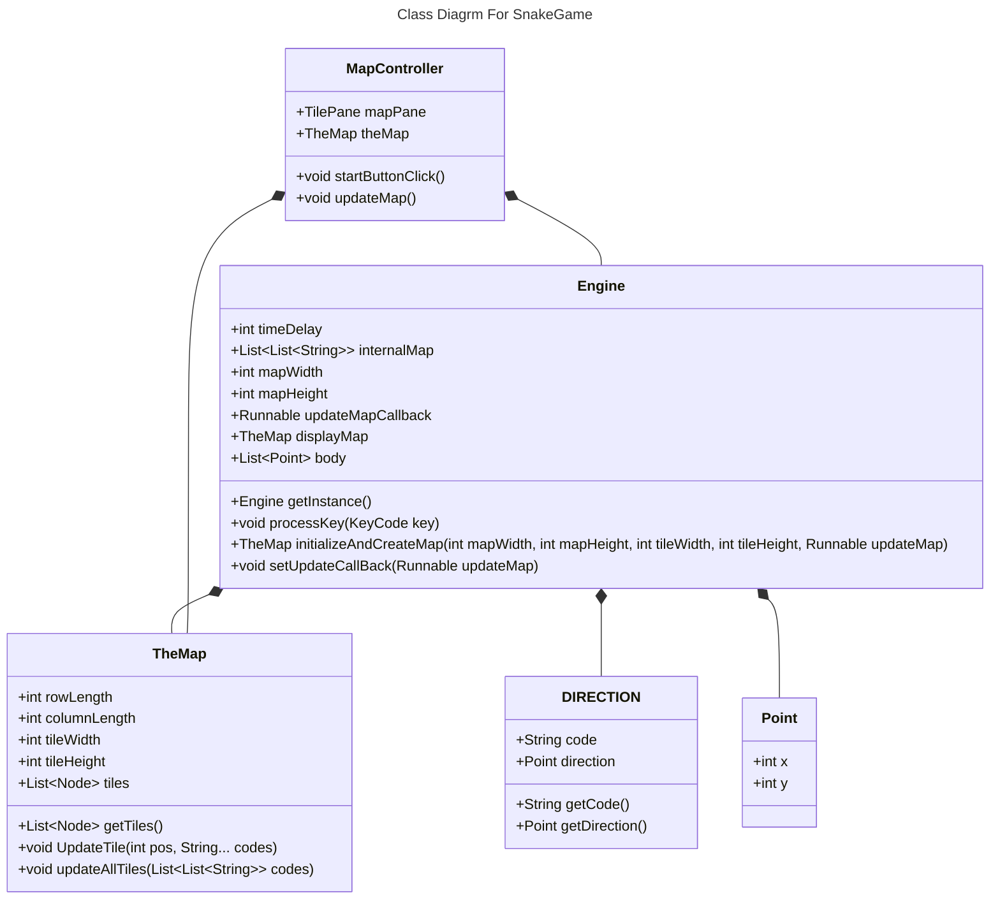

```mermaid
---
title: Class Diagrm For SnakeGame
---

classDiagram  
    Engine *-- DIRECTION
    Engine *-- Point
    Engine *-- TheMap
    MapController *-- TheMap
    MapController *-- Engine
    
    class Point {
        +int x
        +int y
    }
    class Engine {
        +int timeDelay
        +List~List~String~~ internalMap
        +int mapWidth
        +int mapHeight
        +Runnable updateMapCallback
        +TheMap displayMap
        +List~Point~ body
        +Engine getInstance()
        +void processKey(KeyCode key)
        +TheMap initializeAndCreateMap(int mapWidth, int mapHeight, int tileWidth, int tileHeight, Runnable updateMap)
        +void setUpdateCallBack(Runnable updateMap)
    }
    class TheMap {
        +int rowLength
        +int columnLength
        +int tileWidth
        +int tileHeight
        +List~Node~ tiles
        +List~Node~ getTiles()
        +void UpdateTile(int pos, String... codes)
        +void updateAllTiles(List~List~String~~ codes)
    }
    class MapController {
        +TilePane mapPane
        +TheMap theMap
        +void startButtonClick()
        +void updateMap()
    }
    class DIRECTION {
        +String code
        +Point direction
        +String getCode()
        +Point getDirection()
    }

```
