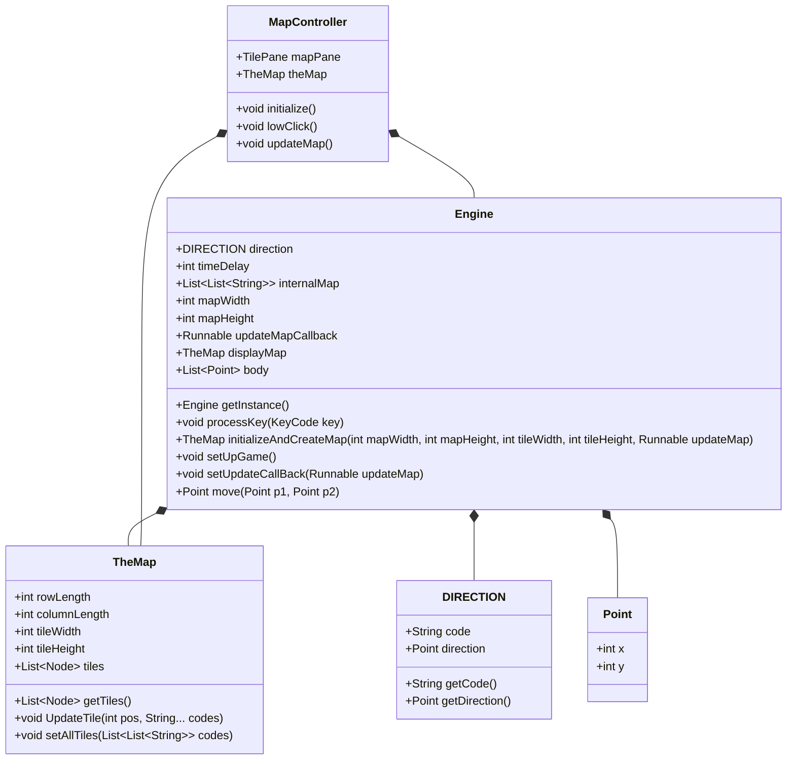
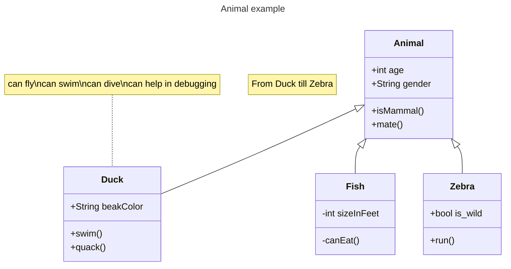

```mermaid

classDiagram  
    Engine *-- DIRECTION
    Engine *-- Point
    Engine *-- TheMap
    MapController *-- TheMap
    MapController *-- Engine
    class Point {
        +int x
        +int y
    }
    class Engine {
        +DIRECTION direction
        +int timeDelay
        +List~List~String~~ internalMap
        +int mapWidth
        +int mapHeight
        +Runnable updateMapCallback
        +TheMap displayMap
        +List~Point~ body
        +Engine getInstance()
        +void processKey(KeyCode key)
        +TheMap initializeAndCreateMap(int mapWidth, int mapHeight, int tileWidth, int tileHeight, Runnable updateMap)
        +void setUpGame()
        +void setUpdateCallBack(Runnable updateMap)
        +Point move(Point p1, Point p2)
    }
    class TheMap {
        +int rowLength
        +int columnLength
        +int tileWidth
        +int tileHeight
        +List~Node~ tiles
        +List~Node~ getTiles()
        +void UpdateTile(int pos, String... codes)
        +void setAllTiles(List~List~String~~ codes)
    }
    class MapController {
        +TilePane mapPane
        +TheMap theMap
        +void initialize()
        +void lowClick()
        +void updateMap()
    }
    class DIRECTION {
        +String code
        +Point direction
        +String getCode()
        +Point getDirection()
    }

```

```mermaid
---
title: Animal example
---
classDiagram
note "From Duck till Zebra"
Animal <|-- Duck
note for Duck "can fly\ncan swim\ncan dive\ncan help in debugging"
Animal <|-- Fish
Animal <|-- Zebra
Animal : +int age
Animal : +String gender
Animal: +isMammal()
Animal: +mate()
class Duck{
+String beakColor
+swim()
+quack()
}
class Fish{
-int sizeInFeet
-canEat()
}
class Zebra{
+bool is_wild
+run()
}
```